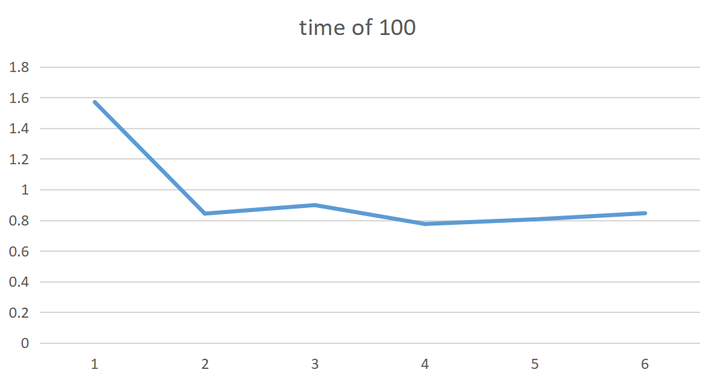
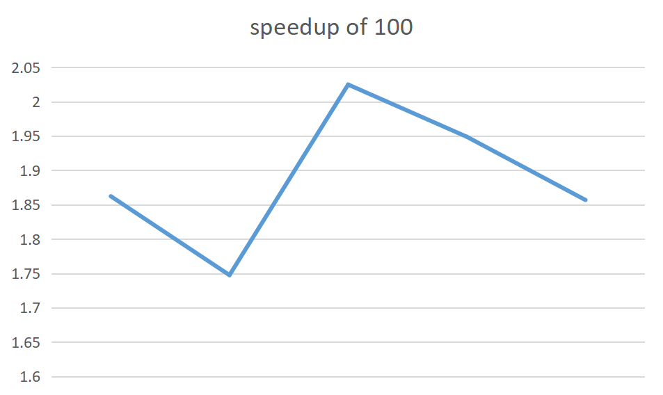
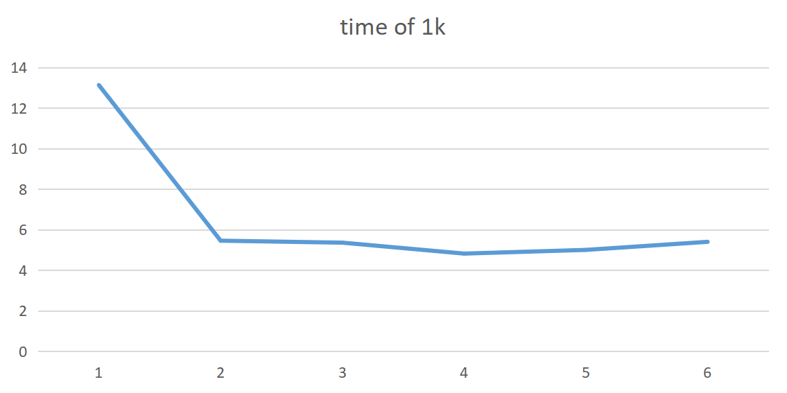
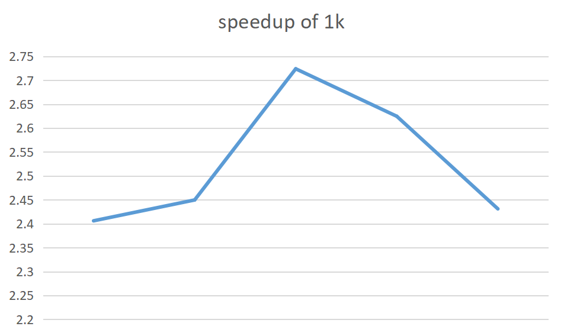
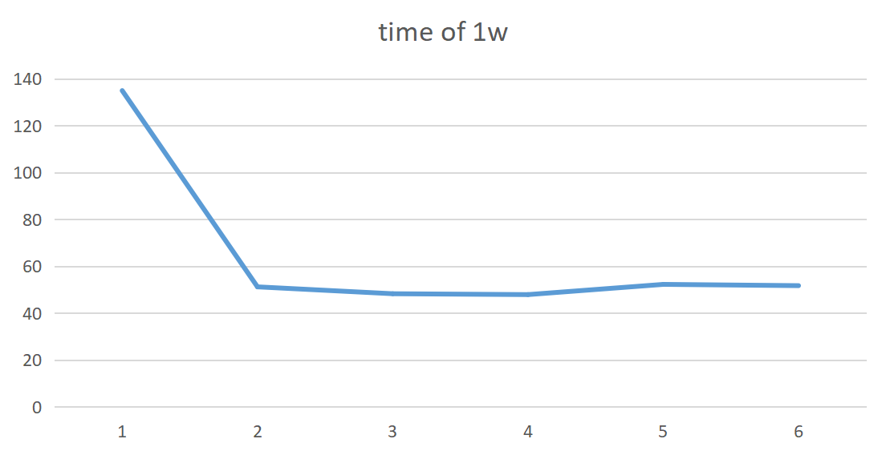
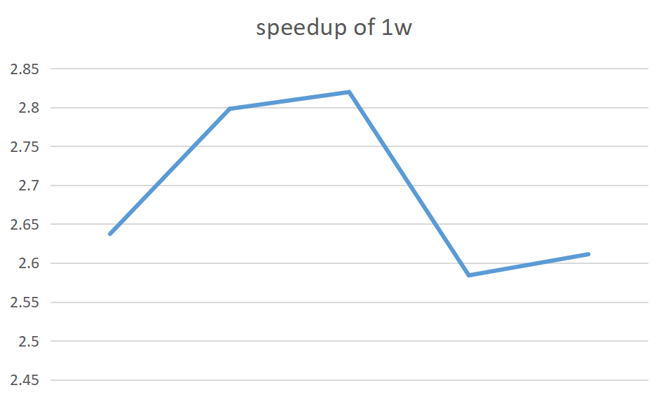
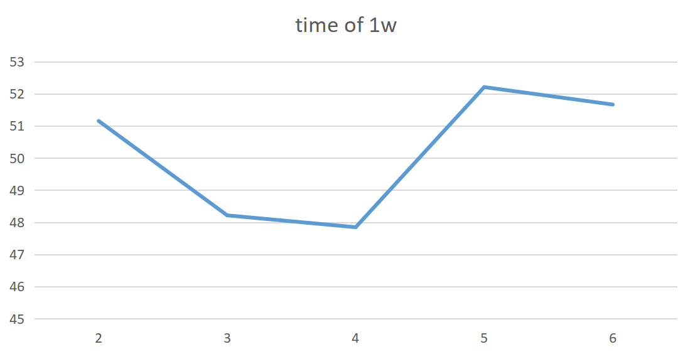

# Performance Report

According to **Amdahl's Law**, we can estimate the performance of our program by $S$
$$
S=\frac{1}{1-a+\frac{a}{n}}
$$
Albeit $a$ can hardly be estimated, we use another formula to calculate $S$
$$
S = \frac{time_{concurrence}}{time_{sequential}}
$$
and with $n$ known, $a$ can be also calculated.

## Environment

Our running environment is

### Main System

- OS:												Windows 10 Pro

- Processor:									Intel(R) Core(TM) i5-7300U CPU @ 2.60GHZ 2.71GHZ

- Installed memory(RAM):			8GB

- Hard Disk:									256GB

### Virtual System

- OS:												Ubuntu 20.04

- Memory:										2 GB

- Processors:									4

- Hard Disk:									20 GB

## Performance

When using algorithm **min_arity**, our $S$ can reach `2.82` when use `4` threads.

### Running time/Speedup ratio with different number of threads

<figure class="third">
    <figure class="half">
    	
        
    </figure>
    <figure>
    	
        
    </figure>
    <figure>
    	
        
    </figure>
</figure>

When use multiplied threads, running time of program **decreases evidently**  compared with that use one.

Whilst the running time of programs with different numbers of thread turn out to be **nearly similar**.

Only focusing on the program use multiplied threads, we can observe the tiny difference among their running time, and get the **nadir** of this graph, which at 4, meaning using 4 threads.

In the graphs of speedup ratio, the peak is more evident. When the number of threads is less than 4, the speedup ratio increases with the increment of the number of threads. Whilst when the number of threads is more than 4, there is a steep decrement.

## Analysis

### Thread limit

Noticing that we have 4 processors in our running environment, the prime performance, which use 4 threads, are probably in the state that each processor regulates 1 thread.

In this case, we can extremely make use of every processors, with no processors vacant and little switch cost token when switch occurs to threads.  

With less threads, there is always one or more processors vacant, causing that resources are underutilized.

With more threads, at least one processor regulates 2 or more threads, causing that unexpected cost on switching threads. When the context switch cost exceeds the parallel benefit brought by the extra threads, the performance of program decreases.

This decrement is especially severe when using another rapider algorithm , which only runs for several millisecond even less per problem. As a truism, the switch between threads cost several microseconds. Provided that the switch cost can afford part of one or even tens of solving of problems, parallel will lose its advance.

### Random read/write

We have each thread deal with one sudoku problem, and then each thread write the solution into the file input.

This raise a problem that when switching to another, the sequential read/write IO will be broke. In this case, the disk head seek would cross sectors and find the right place we read/write, which brings unexpected cost as well.

### Parallel ratio

The parallel ratio, $a$ in **Amdahl's Law**, can be calculated as `0.860434851` when $S$ reaches its peak `2.819491675` with 4 threads.

According to Amdahl's Law, the peak $S$ can reach `7.165112562` in theory. 
$$
S=\frac{1}{1-a}
$$
In another word, we have reached 40 percent of the peak state of performance.