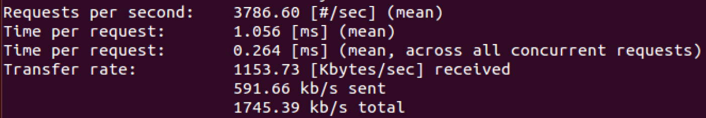
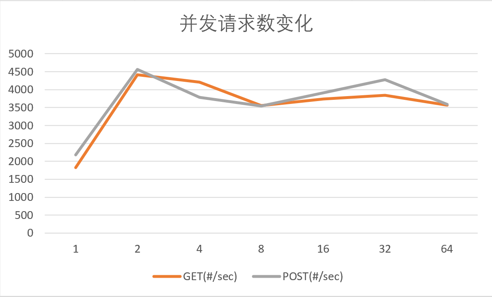
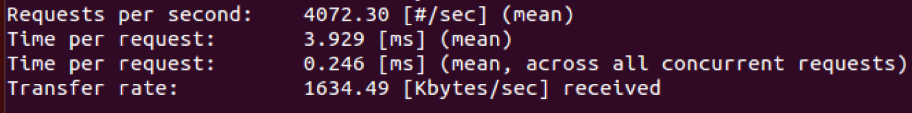

# Lab2 Report

> 红果果与绿泡泡

## 0、写在所有之前

助教老师，十分抱歉的是，因为能力有限，所以实验完成的不是非常完美，所有有几处地方需要说明一下（太菜了我们）：
由于对Git操作的不熟练，提交记录中`Hush`用户对应着我们组员`Panhx0601`

- 关于服务器部署的虚拟机版本，以及实验所用计算机的版本：
    - 实验所用计算机：Intel(R) Core(TM) i5-8250U CPU @ 1.60GHz 1.80 GHz
    - 服务器部署虚拟机：基于VMWare 15.5 的 Linux version 4.4.0-142-generic (buildd@lcy01-amd64-006) (gcc version 4.8.4 (Ubuntu 4.8.4-2ubuntu1~14.04.4) )
- 实现服务器的语言：
    - Java
    - 将项目打包成jar包后，利用cpp可执行文件执行shell命令来运行服务器
    - 并且，因为使用的Java jdk版本为14，因此可以正常运行服务器的Java环境需大于等于该版本
- 服务器所需的`index.html`文件问题：
    - 因为能力确实有限，在项目打包成jar包后，无法找到类路径下保存的文件（真的有点抠脑袋）（我太菜了555）。因此，这里为了解决该问题，将文件路径改为了==绝对路径==，助教在测试的时候，麻烦copy一下文件啊（给您带来不便十分抱歉）
    - 所需文件分别保存在两个路径下（文件已在lab2/src/下给出）：
        - /index.html
        - /dir/index.html


## 1、实验内容

### 1.1、项目结构

```shell
.
├── execute.sh # shell命令
├── lab2server.jar # 服务器jar包
├── Makefile 
├── redgreenserver # 可执行文件
└── redgreenserver.cpp
```

### 1.2、服务器的运行

可执行文件的生成：

```shell
make
```

服务器的运行：

```shell
./redgreenserver -i 127.0.0.1 -p 8888 -t 8
```

- -i：指定IP地址
- -p：指定端口号
- -t：指定线程池大小

### 1.3、测试

#### 1.3.1、并发数测试

- ==请求总数：10000==
- ==CPU数：4==
- ==连接方式：非持续连接==

##### GET方法

并发请求数 1：


并发请求数 2：


并发请求数 4：


并发请求数 8：


并发请求数 16：


并发请求数 32：


并发请求数 64：


##### POST方法

并发请求数 1：


并发请求数 2：


并发请求数 4：



并发请求数 8：


并发请求数 16：


并发请求数 32：


并发请求数 64：


##### 综合



#### 1.3.2、连接方式测试

- ==请求总数：10000==
- ==CPU数：4==
- ==并发数：16==

##### GET方法

非持续连接：


持续连接：



##### POST方法

非持续连接：


持续链接：


##### 综合


#### 1.3.3、CPU核心数测试

- ==请求总数：10000==
- ==连接方式：持续连接==
- ==并发数：16==

##### GET方法

CPU数 1（线程2）：


CPU数 2（线程4）：


CPU数 4（线程8）：


##### POST方法

CPU数 1（线程2）：


CPU数 2（线程4）：


CPU数 4（线程8）：


##### 综合


#### 1.3.4、性能分析

- 并发数测试：

    在并发数很小时，吞吐量很小，计算机资源没有被完全利用。并发数增大后，吞吐量逐渐稳定（ps：在并发数64的时候居然有的时候出现了宕机，服务器直接kill了，不懂）

- 连接方式测试：

    可以看到，持续连接确实比非持续连接块一丢丢哈哈哈。

- CPU数测试：

    CPU为2的时候居然比CPU为4的时候要快不少，感觉不太准确，以后有机会再搞个阿里云服务器试试看。
